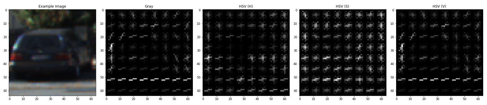

# Vehicle Detection

The goals / steps of this project are the following:

* Perform a Histogram of Oriented Gradients (HOG) feature extraction on a labeled training set of images and train a classifier Linear SVM classifier
* Optionally, you can also apply a color transform and append binned color features, as well as histograms of color, to your HOG feature vector.
* Note: for those first two steps don't forget to normalize your features and randomize a selection for training and testing.
* Implement a sliding-window technique and use your trained classifier to search for vehicles in images.
* Run your pipeline on a video stream (start with the test_video.mp4 and later implement on full project_video.mp4) and create a heat map of recurring detections frame by frame to reject outliers and follow detected vehicles.
* Estimate a bounding box for vehicles detected.

### Histogram of Oriented Gradients (HOG)

The code for this step is contained in `1_TrainClassifier.ipynb` .  

#### 1. extract HOG features from the training images.

1. Data Exploration

I started by reading in all the `vehicle` and `non-vehicle` images.  

dataset statistics:

```
- n_car 8792
- n_notcars 8968
- image_shape (64, 64, 3)
- data_type float32
```

example image:


2. HOG Feature Extraction

I then explored different color spaces and different `skimage.hog()` parameters (`orientations`, `pixels_per_cell`, and `cells_per_block`).  I grabbed random images from each of the two classes and displayed them to get a feel for what the `skimage.hog()` output looks like.

Here is an example using the `HSV` color space and HOG parameters of `orientations=9`, `pixels_per_cell=(8, 8)` and `cells_per_block=(2, 2)`:



#### 2. how I settled on my final choice of HOG parameters..

the process is the following ..

1. choose some combinations of parameters
2. extract HOG features
3. train classifier using these features
4. check prediction accuracy of test-dataset

Finally, I have chosen the following parameters which produce the best accuracy.

```
colorspace = 'HSV'
channels = 3 (ALL of HSV)
orient = 9
pix_per_cell = 8
cell_per_block = 2
```

#### 3. how I trained a classifier.

I trained a linear SVM(C=1.0).

I used both of the HOG features & color features.

- HOG features (I have described)
- Color bin features (cspace='RGB', resize to (32,32,3))
- Color histogram (cspace='RGB', spatial_size=(32,32), hist_bins=32)

the train-dataset shape is `(17760, 8460)`

I obtained the classifier which predict test-dataset with accuracy ~ 0.98-0.99

### Sliding Window Search

The code for this step is contained in `2_VehicleDetection.ipynb` .  

#### 1. how I implemented a sliding window search. (scales to search, how much  windows overlap)

the process is the following ..

1. sliding window with multiple scape and windows-overlap
2. apply classifier to each extracted image
3. save window position if `prediction == "Car"`

I tried many many times to get good detection heatmap.
the final parameters are the following

"""
windows1 = slide_window(image, x_start_stop=[700, None], y_start_stop=[390, 500],
                    xy_window=(90, 90), xy_overlap=(0.8, 0.8))
windows2 = slide_window(image, x_start_stop=[600, None], y_start_stop=[390, 540],
                    xy_window=(110, 110), xy_overlap=(0.85, 0.85))
windows3 = slide_window(image, x_start_stop=[600, None], y_start_stop=[390, 560],
                    xy_window=(130, 130), xy_overlap=(0.9, 0.85))
windows4 = slide_window(image, x_start_stop=[600, None], y_start_stop=[390, 600],
                    xy_window=(150, 150), xy_overlap=(0.85, 0.85))
windows = windows1 + windows2 + windows3 + windows4
"""


#### 2. examples of test images to demonstrate how my pipeline is working.

I dropped out pixels if `the value of each pixels of the heat map` is lower than `threshold` to improve prediction performance (drop false-positive & combine multiple window).

1. create heat map of window (Add += 1 for all pixels inside each bbox, while iterating through list of bboxes.)
2. zero out pixels below the threshold
3. combine window
4. draw final bbox


---

### Video Implementation

#### 1. a link to the final video output.

Here's a [link to my video result](./video_out.mp4)

#### 2. describe how I implemented some kind of filter for false positives and some method for combining overlapping bounding boxes.

I recorded the positions of positive detections in each frame of the video.  From the positive detections I created a heatmap and then thresholded that map to identify vehicle positions.  I then used `scipy.ndimage.measurements.label()` to identify individual blobs in the heatmap.  I then assumed each blob corresponded to a vehicle.  I constructed bounding boxes to cover the area of each blob detected.  


---

### Discussion

#### 1. Briefly discuss any problems / issues in my implementation, where my pipeline likely fail, what I can do to make it more robust.

* issue: pipeline is slow, which can be made faster by using sub-sampling HOG feature maps, but I want to try `Convolutional Neural Network` at next.

* maybe fail case: if it's night, my pipeline may fail to detect vehicles.

* some ideas to make it more robust:
  - use `Convolutional Neural Network` for Object Detection (`Faster RCNN`, `SSD`, `YOLO`, ..)
  - filter along time-axis (e.g. `alpha-beta-filter`, `kalman-filter`)
